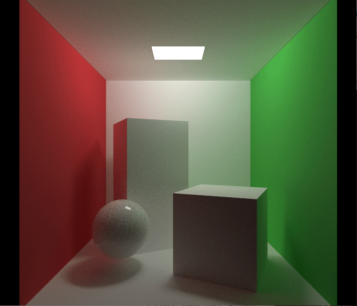

# Crystal 2
An offline physically-based ray-tracing renderer, based on my old project Crystal Engine. The architecture of this project is largely based on PBRT-v3, but specific implementations are done by myself. The goal of this project is to build a physically-based renderer from scratch, learn and practice various global illumination algorithms, and can even be used as pre-processing tool for real-time rendering.

## How to compile
```
$ mkdir build
$ cd build
$ cmake ..
$ make
```

## Useage
```
$ ./Crystal2 <config file> <scene file>
```

## Features
1. Integrators
- [x] Path Tracing
- [x] Path Tracing + MIS Lighting
- [x] Photon Mapping
- [ ] Bidirectional Path Tracing

2. Materials
- [x] Diffuse Material
- [x] Mirror Material
- [x] Glass Material
- [x] Microfacet Glass Material
- [x] Microfacet Material (GGX)
- [x] Microfacet Material (Anisotrophic)
- [x] Phong Material

3. Samplers
- [x] Random Sampler
- [x] Stratified Sampler
- [ ] Halton Sampler

4. Textures
- [x] 2D Texture
- [x] Skybox Texture
- [ ] 3D Texture
- [ ] Binlinear Interpolation
- [ ] Mipmap

5. Geometry
- [x] Sphere
- [x] Triangle Mesh
- [x] Triangle
- [x] Disk 

6. Acceleators
- [x] Brute force
- [x] BVH with SAH
- [ ] K-D Tree
- [ ] ?

7. Lights
- [x] Point Light
- [x] Area Light  

8. Volume Scattering
- [ ] Volume Path Tracer

9. Scene Loader
- [x] JSON Loader

## Demos
### Physically Based Rendering





